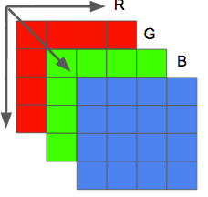

# 介绍

踏入流媒体新世界大门， 记录过程中的所见所思。

# 更新日志

# 目录

- [介绍](#介绍)

- [概念](#概念)
  - [图像](#图像)
  - [视频](#视频)
  - [容器](##容器)

- [学习资源](#学习资源)

# 概念

## 图像

图像说白了就是一个二维矩阵，且支持多通道。 单通道图为灰度图， 三通道为彩色图。矩阵中的每个点称为**像素(图像元素)**。像素的色彩由三原色(RGB)的强度表示。

三通道的图像可以理解成由三个通道的二维平面叠加而成。

存储颜色的强度需要一定大小的数据空间， 这个大小就是**颜色深度**。 假如每个颜色强度占用8bit（0~255）,那么颜色深度就是24(3*8)bit。所以1个字节表示颜色强度可有$2^{24}$ 种颜色 

图像的分辨率是单个平面内像素的数量， 通常由宽*高表示。

## 视频

## 容器

# 学习资源

[FFmpeg 视频处理入门教程](http://www.ruanyifeng.com/blog/2020/01/ffmpeg.html)

[digital_video_introduction](https://github.com/leandromoreira/digital_video_introduction)

[ffmpeg-libav-tutorial](https://github.com/leandromoreira/ffmpeg-libav-tutorial)

[An ffmpeg and SDL Tutorial](http://dranger.com/ffmpeg/)

