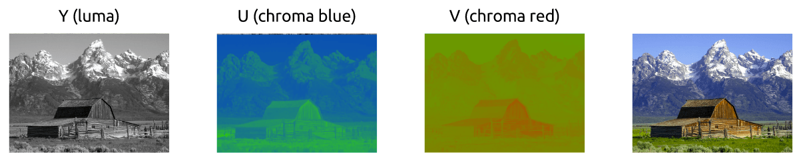
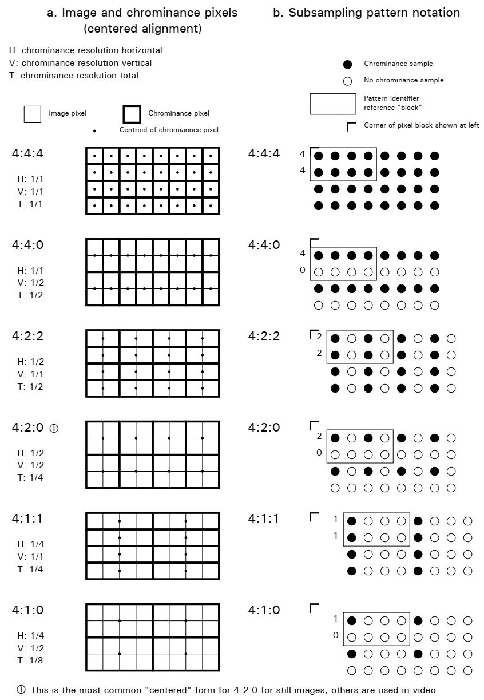
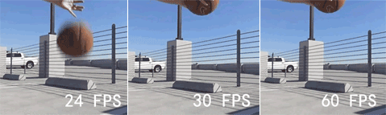

# 介绍

踏入流媒体新世界大门， 记录过程中的所见所思。

# 更新日志

# 目录

- [介绍](#介绍)

- [概念](#概念)
  - [图像](#图像)
  - [视频](#视频)
  - [容器](##容器)

- [学习资源](#学习资源)

# 概念

## 图像与颜色模型

最常用的色彩模型有三类：**RGB**(用于计算机图形学), **YUV**(用于视频系统),  **CMYK**(用于彩色印刷)。本文中仅仅介绍前两种。

图像说白了就是一个二维矩阵，且支持多通道。 单通道图为灰度图， 三通道为彩色图。矩阵中的每个点称为**像素(图像元素)**。像素的色彩由三原色(**RGB**)的强度表示。

三通道的图像可以理解成由三个二维平面叠加而成。


存储颜色的强度需要一定大小的数据空间， 这个大小就是**颜色深度**。 假如每个颜色强度占用8bit（0~255）,那么**颜色深度就是24**(3*8)bit。所以1个字节表示颜色强度可有**2^24** 种颜色 


图像的**分辨率**是单个平面内像素的数量， 通常由**宽*高**表示。 

图像有三个宽高比表示：

- 显示宽高比**DAR**(Display Aspect Ratio)，即最终播放出来的画面的宽与高之比。
- 单个像素宽高比**PAR**(Pixel Aspect Ratio)，长宽比为1时，这时的像素我们成为方形像素。
- 采样纵横比**SAR**(Sample Aspect Ratio)，视频横向对应的像素个数比上视频纵向的像素个数。即为我们通常提到的分辨率。

它们之间的关系是：**DAR=SAR x PAR**

### RGB数据格式

RGB数据格式按颜色深度可分为主要分为16、24、32三种:

- RGB 16:  **RGB 555** 和 **RGB 565**
- RGB 24: **RGB888**
- ARGB32

**RGB 555**

即`5位R,5位G,5位B`, 最高位闲置：0<span style="Color:Red;border: 1px solid black;">RRRRR</span><span style="Color:Green;border: 1px solid black;">GGGGG</span><span style="Color:Blue;border: 1px solid black;">BBBBB</span>

```c
R = color & 0xF800;
G = color & 0x07E0;
B = color & 0x001F;
```

**RGB 565**

即`5位R,6位G,5位B`：<span style="Color:Red;border: 1px solid black;">RRRRR</span><span style="Color:Green;border: 1px solid black;">GGGGGG</span><span style="Color:Blue;border: 1px solid black;">BBBBB</span>

```c
R = color & 0xF800;
G = color & 0x07E0;
B = color & 0x001F;
```

**RGB 888**

即`8位R,8位G,8位B`：<span style="Color:Blue;border: 1px solid black;">BBBBBBBB</span><span style="Color:Green;border: 1px solid black;">GGGGGGGG</span><span style="Color:Red;border: 1px solid black;">RRRRRRRR</span>

```c
R = color & 0x0000FF;
G = color & 0x00FF00;
B = color & 0xFF0000;
```

**ARGB32**

即`8位R,8位G,8位B,8位A`：<span style="Color:Blue;border: 1px solid black;">BBBBBBBB</span><span style="Color:Green;border: 1px solid black;">GGGGGGGG</span><span style="Color:Red;border: 1px solid black;">RRRRRRRR</span><span style="Color:Gray;border: 1px solid black;">AAAAAAAA</span>

```c
R = color & 0x0000FF00;
G = color & 0x00FF0000;
B = color & 0xFF000000;
A = color & 0x000000FF;
```

### YCbCr(YUV)

除了上述表示图像的RGB颜色模型外， 还有一种**YCbCr**的颜色模型，YCbCr将亮度和色度(颜色)分离:

- Y表示亮度
- Cb表示蓝色色度
- Cr表示红色色度



早期的黑白电视仅仅使用亮度值Y即可， 后续彩电为了兼容黑白电视，在Y亮度值之上添加了UV色度值。 所以彩色电视同时可以播放黑白视频。

#### RGB与YCbCr相互转换

RGB=>YCbCr

```
Y = 0.299R + 0.587G + 0.114B
Cb = 0.564(B - Y)
Cr = 0.713(R - Y)
```

YCbCr=>RGB

```
R = Y + 1.402Cr
B = Y + 1.772Cb
G = Y - 0.344Cb - 0.714Cr
```

#### YUV的采样方式和存储模式

##### 采样方式

现代编解码器中采用了**色度子采样**的方式进行采样。也就是**色度分辨率低于亮度**。也称子采样系统。

并用三部分比率表示: `j:x:y` , 其定义了亮度与色度平面之间的关系。通常以两行每行4个采样点方式:

- j为水平采样参考，通常为4

- x表示每j个采样点的第一行，色度样本的个数

- y表示每j个采样点的第二行，色度样本的个数

**j为全采样， 通常多少个像素则采样多少个j**。常用的采样方式为: `4:4:4`、 `4:2:2`、 `4:1:1`、 `4:2:0`、 `4:1:0`、 `3:1:1`

如下图各个采样方式:



- 其中4:2:2表示，两行每行4个采样点第一行采样2个UV，第二行采样2个UV。从上图右侧实心圆所在行列可得到结论:水平方向每2个像素采样1个色度样本；垂直方向每1个像素采样1个色度样本。
- 以上一点类推4:2:0, 两行每行4个采样点第一行采样2个UV，第二行采样0个UV。从上图右侧实心圆所在行列可得到结论: 水平方向每2个像素采样1个色度样本；垂直方向每2个像素采样1个色度样本。

##### 存储方式

YUV存储方式分为三类**packed、planar、semi-planar**:

- packed

  基本格式为: YUYV

  命名不带后缀，即YUVxxx, xxx通常为444、420等, 如YUV420

- planar

  基本格式为: YYYY UU VV

  命名带后缀P，即YUVxxxP, xxx通常为444、420等, 如YUV420P

- semi-planar

  基本格式为: YYYY UVUV

  命名带后缀SP，即YUVxxxSP, xxx通常为444、420等, 如YUV420SP

> packed 格式通常用于只含水平采样的采样方式, 不能处理垂直采样。即垂直采样必须为1/1

**YUV420**

每4个像素共用一个色度样本， 每个色度样本包括1个U像素、1个V像素。 如果位深为8， 则平均每8bit含2bit的U、2bit的V， 总12bit。YU12、YV12及NV12中的12表示12bit。

- 无packed 存储

- plannar存储

YU12/IYUV/I420:

```
Y Y Y Y
Y Y Y Y
Y Y Y Y
Y Y Y Y
-------
U U
U U
-------
V V
V V
```

YV12:

```
Y Y Y Y
Y Y Y Y
Y Y Y Y
Y Y Y Y
-------
V V
V V
-------
U U
U U
```

- semi-planar 存储

NV12:

```
Y Y Y Y
Y Y Y Y
Y Y Y Y
Y Y Y Y
-------
U V U V
U V U V
```

NV21:

```
Y Y Y Y
Y Y Y Y
Y Y Y Y
Y Y Y Y
-------
V U V U
V U V U
```

**YUV422**

每4个像素共用2个色度样本

- packed 存储

YUYV(YUY2)模式:

```
[YU] [YV] [YU] [YV]
[YU] [YV] [YU] [YV]
[YU] [YV] [YU] [YV]
[YU] [YV] [YU] [YV]
```

UYVY模式:

```
[UY] [VY] [UY] [VY]
[UY] [VY] [UY] [VY]
[UY] [VY] [UY] [VY]
[UY] [VY] [UY] [VY]
```

- planar存储

YU16

```
Y Y Y Y
Y Y Y Y
Y Y Y Y
Y Y Y Y
-------
U U U U
U U U U
-------
V V V V
V V V V
```

YV16

```
Y Y Y Y
Y Y Y Y
Y Y Y Y
Y Y Y Y
-------
V V V V
V V V V
-------
U U U U
U U U U
```

- semi-planar存储

NV16

```
Y Y Y Y
Y Y Y Y
Y Y Y Y
Y Y Y Y
-------
U V U V
U V U V
U V U V
U V U V
```

NV61

```
Y Y Y Y
Y Y Y Y
Y Y Y Y
Y Y Y Y
-------
V U V U
V U V U
V U V U
V U V U
```


## 视频

视频即是在单位时间内连续的播放 n 帧的图像。 若单位时间为秒，则n为帧率**FPS**(Frames Per Second), 表示每秒帧数。常用视频FPS有24fps、30fps、60fps三种, 流畅度差异如下图所示:



**比特率**是播放视频每秒所需的数据量（即常说的**码率**）。

> 比特率 = 宽 * 高 * 颜色深度 * 帧每秒

一段每秒 30 帧，每像素 24 bits，分辨率是 480x240 的视频，它将需要 **82,944,000 比特每秒**或 82.944 Mbps (30x480x240x24)。

比特率又分为恒定比特率(**CBR**)和可变比特率(**VBR**), 差别在于一个恒定一个可变。

#### 帧类型

##### I帧

##### P帧

##### B帧

## 容器

视频文件本身其实是一个容器（container）或封装格式，里面包括了视频和音频，也可能有字幕等其他内容。常见的封装格式包括:

- mp4
- avi
- mkv
- webm
- flv

# 参考资料

[FFmpeg 视频处理入门教程](http://www.ruanyifeng.com/blog/2020/01/ffmpeg.html)

[digital_video_introduction](https://github.com/leandromoreira/digital_video_introduction)

[ffmpeg-libav-tutorial](https://github.com/leandromoreira/ffmpeg-libav-tutorial)

[An ffmpeg and SDL Tutorial](http://dranger.com/ffmpeg/)

[详解yuv系列（一）---YUV444](https://blog.51cto.com/u_7335580/2059670)

[色彩空间与像素格式](https://www.cnblogs.com/leisure_chn/p/10290575.html)

